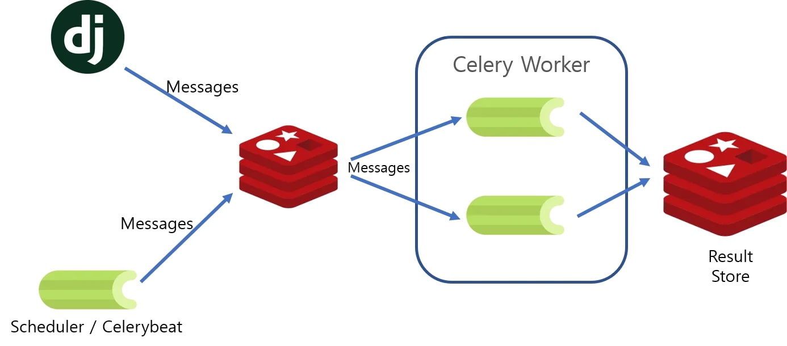

# Hoosh Pardaz Parstech Interview Project

## 💡 Overview
In this project, a shipment tracking API has been developed by which the user can get the list of all the shipment and check the status of a single article as well. 


## ⚙️ Project Structure
As this application has very brief functionalities, it includes few amount of services. Python is the main programming language used for developing the services. Let's discuss more about the technical details.

### web Framework
The API service employs Django web framework and PostgresSQL as the primary database of the backend service. Django models defines the structure of the tables in our database. One of the main advantages of Django framework is that it handles the process of accessing the database and the queries by its own. This feature helps developer to not pay attention to the details of accessing the database and the connectors, and moreover developers do not need to write SQL code for their queries, since django provide built-in methods to query on the dataset using only python code, even for the very complex queries.

### Backend Database
The databases used in this project are the PostgresSQL as the primary database in the production stage and Sqlite for debugging purposes. Our django code checks if we are in the debugging stage, uses the Sqlite instead of heavy-weighted database like Potgres. However, in the deployment stage, we have used the Potgres database because of the security, usage convinience and its speed. In addition, Potgres brings extenssions to suport more data types, which makes it one of the best relational databases.

### Job Distributer
One of the challenges of this project was to efficiently handle the request to the external sources. The API for the list of shipments must provide the current weather condition of the location of the shipment. Therefore, we needed to use some third-party APIs for the weather condition ([WeatherAPI](https://www.weatherapi.com/) is the service used in this project). This job could be carried out using serveral ways. 
1. Develop a separate standalone service to request to the Weather API endpoint and update a table of the backend database with the fetched information.
2. 🌟 Use a job distributer and implement make a function in our Django app to send the task (Updating weather information) to it. This is the procedure I chose to have in this application. [`Celery`](https://docs.celeryq.dev/en/stable/getting-started/introduction.html), which is an asynchronous task queue and commenly used for handling background tasks, is the job distirbuter used for this purpose in our project. Django transmits the updating weather tasks to Celery using a message broker like RabbitMQ or Redis. The celery then distribute the tasks acroos the one or more worker processes. The Celery worker is the process that runs in the background and executes the tasks that are sent to it. 


<div style="border: 1px solid #999; padding: 10px;">

**Then why not to request to the API endpoint in our web server?** \
In order to make sure that the web application runs smoothly and without any delays, developers must offload any time/resource-intensive task, which runs independently from the web application service. In particular, when the web server receives lots of requests from the users. 
</div>

<br>

<div id="MB">

### Message Broker
As mentioned earlier, django sends the tasks to the celery using a message broker. For this project, I chose to use Redis as the message broker over the RabbitMQ. **Then why?** Because Redis is actully a Key-Value NoSQL database. In addition, Redis is known as an in-memory database, which makes it so fast to retrieve data from it. These two features bring so many functionalities to Redis. Such as storing stream data, time series data, and also being used as a message broker. Having the capability of working as a database, is main reason to chose Redis over the other available tools for our project. 

After completing the given tasks, the celery worker must store the result somewhere. So, an other database is needed here to fullfill this need. This is the place that Redis comes handy and helps us store the results in itself as well as facilitating the process of the transmitting the tasks.

⚠️ It is worth mentioning that in the larger systems, it may be necessary to employ a different database as the number of requests and users grow, since the storing data in the memory requires more amount of memory in the server. Thus separating the message queue and the results' database become a must!
</div>

### Task Scheduler
One of the required parts of the project is to limit the number of request to the third-party weather API. **Why?** Because open APIs allow users to use the service for a limited amount requests. This is for preventing the problem of over-usage or security problems like DDos attacks. Therefore, it is necessary to send requests to that service periodically. To tackle this problem, the Django app, create the updating weather tasks every 2 hours to satisfy this requirement. The component responsible for scheduling these tasks is `Celery Beat`. Celery Beat schedules tasks by sending messages to the message broker at predefined intervals. These messages are then consumed by Celery workers, which execute the scheduled tasks.

The picture below, illustrates the architecture of this application. Notice that there is only one Redis server in our project.

<div >

</div>

<br>

## **How to run?**
For running this project, you can clone this repo into your local machine and then just run:

```shell
docker compose up -d --build
```

And the you can find the application in ```http://localhost```.

<br>

## 🔍 Discussion Points
**What were the important design choices and trade-offs you made?** \
To designe this system, choosing the right backend database, handling the requests to the external resources and using Redis over the other message brokers such as RabbitMQ were the times that I needed to consider trades-offs between the available options. 
1. **Backend Database:**  As the data using in this project is structured and do not change over the time, I prefer to use a relational database rather than a NoSQL database like MongoDB. Among many popular and available relational databases, I went for the PostgresSQL because of its high security levels, convinience to use and its speed. 
2. **Handling Requests To External Resources:** Taking advantage of a background task distributer over sending requests directly from the django application, was the second trade-off in our design. Off-loading time intensive tasks like these external requests puts high pressure on the web server. Therefore if we need our application to run smoothly, it becomes a must to send those tasks to other processes to do the tasks and return back the results.
3. **Message Broker:** It is fully explained in <a href="#MB"> this section. </a>

<br>

**What would be required to deploy this application to production?** \
To deploy this application, it takes several steps;
1. **Prepare Docker Images:** I have provided Dockerfile inside the application directory, which is used to build a docker image from our Django application. In addition, the docker-compose uses this Dockerfile to build the images when trying to compose all the services at the same time.
2. **Store Secrets Securely:** All the secret variables in this project have been stored in `.env` file locally, and added to the `Github Secrets` to be used in the CI pipeline.
3. **Set Up Production Database:** As discussed earlier, the database for using in the production is the PostgreSQL database. In the docker-compose file, we have defined the `postgres:latest` image as the main image to use for this service. The lastest tag means to fetch the latest stable version of the Postgres. All the configurations of this database have been included in the `.env` file and the Github secrets.
4. **Update Django Settings:** It is necessary to set the DEBUG variable to False in the production and add the IP addresses or the domains of the service to the ALLOWED_HOSTS in the Django settings file.
5. **Use a Web Server:** The Gunicord has been used as the production-ready web server. The Gunicorn is designed to handle production traffic efficiently.
6. **Horizontally Scale Application Servers:** Based on the number of requests to our services and the load, we can use orchestration tools like Kubernetes or Docker Swarm to increase (or decrease) the number of instances of servers belonging to our services.
7. **Continuous Integration and Continuous Delivery/Continuous Deployment (CI/CD):** In this project, we have used Github actions workflows to automate the integration jobs like health-Check, running the tests and pushing the docker images to the registry. It is also capable of handling Continuous Deployment process. In other words, we can use the provided actions to directly deploy our code after pushing to the Git repository.

<br>

**What would be required to scale this application to handle 1000 requests per second?**
There are several factors to apply to our system to eliminate botthenecks in order to handle this amount of requests or more!
1. **Optimize Database Queries:** Using optimized queries reduces the fetch time and consiquently the application works faster when working with the database. Having complex queries can help us with regard as the query time will be much more faster rather than processing the larger data in the code.
2. **Horizontally Scale Application Servers:** Again, having multiple server instances of the application can reduces the amount of load from one signle server
3. **Using a Load Balancer:** Along with the multiple servers, we can take advantage of load balancers to distribute the requests and load across those servers. This increases the overall capacity of the system.
4. **Optimizing Celery Workers:** Based on the server resources, we can optimize the number of process or celery workers to handle more amount of tasks at the same time.
5. **Scale the Task Scheduler (Celery Beat):** Running multiple instances of the Celery Beat can eliminate the bottleneck in the task scheduler.
6. **Database Sharding:** If there is a bottleneck in the database, due to the large amount of data, we can use database sharding in order to partition the database to distribute the load.
7. **Monitoring:** Haing monitoring tools to track the performance of the services and the servers help us keep an eye on the whole system and dynamically adjust it based on the load on the servers.


## API Endpoints
Users can access the list of shipments by a GET request to the `/shipment/` endpoint and also by sending a POST request containing two parameters, `tracking_number` and `carrier`, in the body of the request to this endpoint.

* **GET**  - `/shipment/` - Access the list of all the shipments.
* **POST** - `/shipment/` - Check the status of a single shipment using the tracking number and the carrier.
  * The body must include the `tracking_number` and the `carrier`

